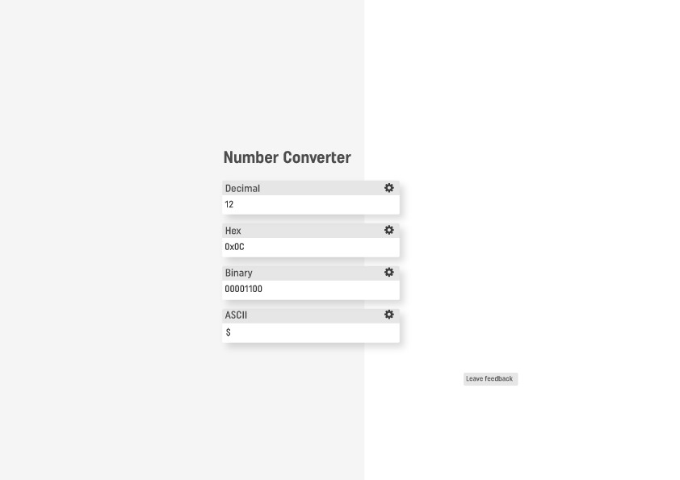

# Number Converter

## Layout
             _______________________
        Dec |_______________________| *
             _______________________
        Hex |_______________________| *
             _______________________
        Bin |_______________________| *
             _______________________
      ASCII |_______________________| *
                   (?)     (X)

## Goal
- Numbers can be entered in any field
- The number label turns bold upon valid input, or red upon invalid
- Entered number is auto-converted into other fields
- Support math operations
  - Addition/subtraction
  - Multiplication/division
  - Bitwise and/or/not/xor/shift
  - Modulo
- If math is detected
  - Expand fields to wide format
  - Auto convert & display each number into other fields
  - Allow math between different number types (e.g. 123 & 0x0F)
  - Right-justify answer
- Gear 'settings' icon next to each field
  - Group numbers (e.g. 4, 8, 16) / Representation (e.g. 8-bit, 16-bit, 32-bit)
  - Spacing between groups
  - Upper/lowercase
  - Add/remove prefix (e.g. '0x', 'b')
  - Enable/disable 'colour highlight on hover'
- If a word is entered into ASCII, decode each char
- Hovering over the question mark (?) explains how to use
- Clicking the (X) will clear the fields
- If you hover over a single character within a word/number, then that section of the word/number will be highligthed in each of the other fields. For example, hovering over the '2' in the word '0x12' will result in the right 4 digits of '001**0010**' change colour. The intention is that it makes it easier to understand the composition of larger numbers.

## Optimisation/Improvement Ideas
- When parsing, store a copy of the full string. Upon next request to parse (e.g. upon next 'input' event), compare the new string with the previously stored string. If they are similar, then we may only have to parse the bit that changed, rather than the full string again.
- If a space separator is not used between 'number words' & operands, the parser should still work (i.e. it should detect a number word followed by an operand)
- Pressing the 'tab' key should select each field in an intuitive order

## Name Ideas
- Num Tool
- Number Converter
- Num Rep (Number Representation)

## Layout Concept
- Need to add rounded corners to field
- Add a (?) button below the fields to allow a user to hover for help
- Add a (x) button below the fields to clear entries
- Maybe use a single gear below the fields

## TODO
- Add Zoe Thexton as a contributor
